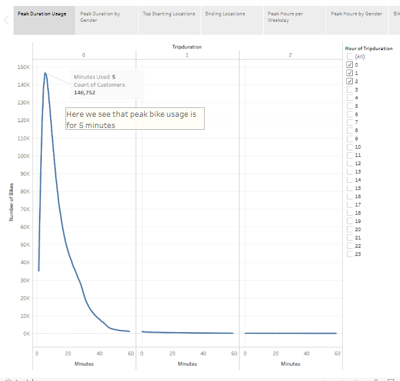
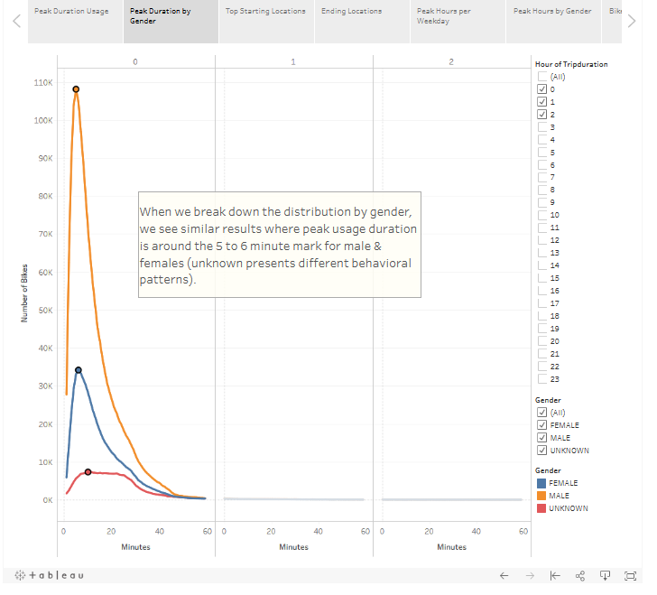
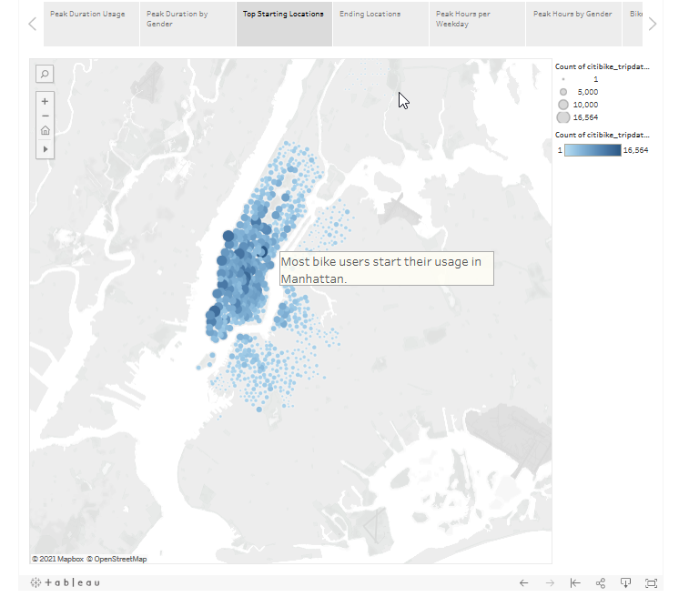
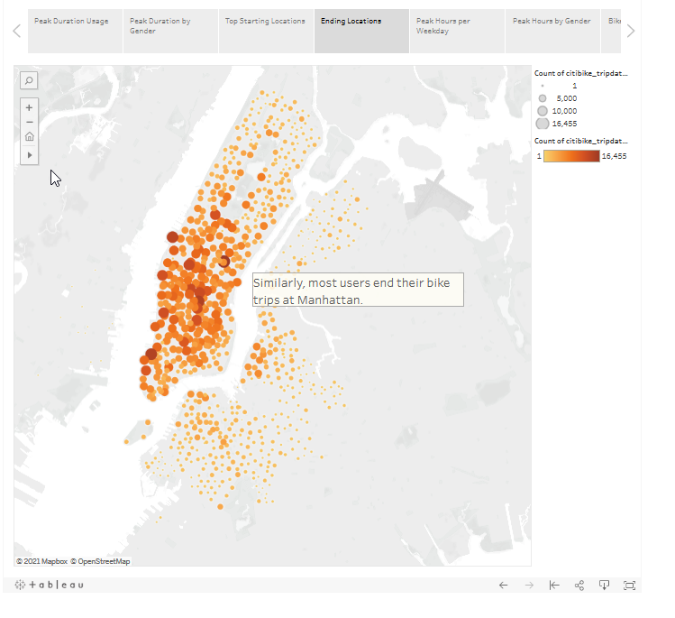
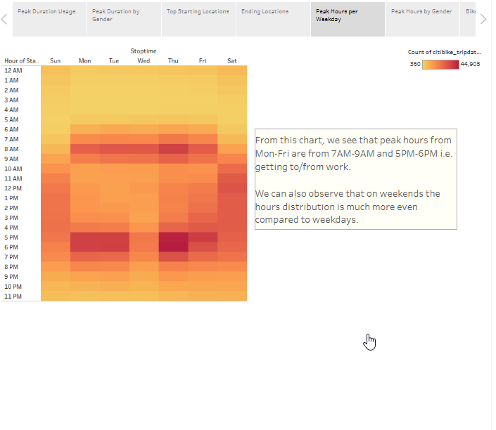
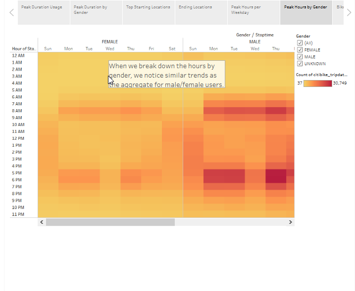
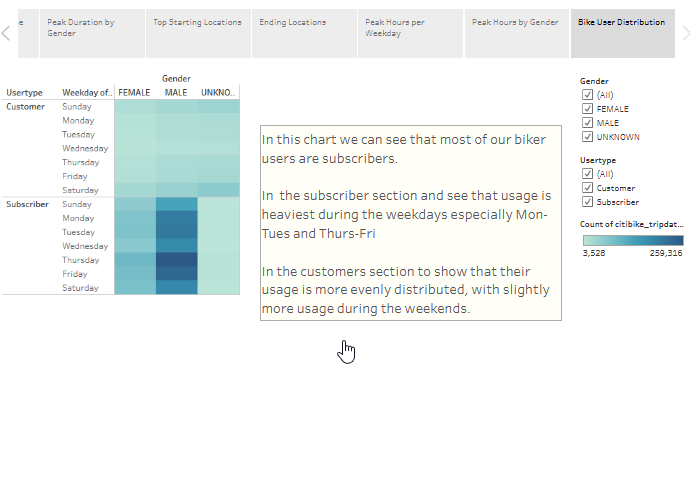

# NYC Citibike Analysis

## Overview

The purpose of this analysis is to study several habits observed in the citibike data from New York City, where we hope to use the observations to help set-up our bike share business going forward. These observations will be shown as pictures below but a dashboard is available for users to interact with the data (dashboard link provided at the end).

## Results

Below, we will highlight a few key observations from the data.

### Observation 1: Usage Duration

One of our first observations was to see how long patrons use the bike for. The chart below shows that most of the customers use bike-sharing programs for under an hour and peaks around the 5 minute mark i.e. use it for short distance travel.

  

When we dig further by gender, we see similar trends where most of the travel done are under an hour and peak around the 5 minute mark. Note also that most of the users are male.

  

### Observation 2: Usage Location

Another observation from the data is that bike-sharing occur predominantly in downtown Manhattan and the graphs below show the starting/end locations. The charts also collaborate with our earlier finding where bike-sharing is used for short travel as the starting/ending locations are quite similar.

  

  

### Observation 3: 

From our data, we were also able to find out the peak hours of operations for the bike-sharing program. We see that peak hours typically occur from 7-9am and 5pm-6pm on weekdays, which likely coincides with users going to/from work. On the weekends however, we see the hours more spread out and is most likely used for leisure purposes.

  

When we dig in the data a bit further by gender, we note similar trends between genders as observed above.

  

### Observation 4:

Lastly, we observe the different customer base in the bike-sharing program as well as note the peak weekday usages. Predominantly, bike-sharing programs are used by subscribers and are most heavily used during the weekdays. Regular customers on the other hand, show a more distributed usage and is likely more for leisure.

  

## Summary

From our results, we were able to track the behavior of the bike-sharing community that is likely translatable to our business going forward. Users of the program will likely use it for short distance traveling near a downtown area mostly to get to/from work. Furthermore, most of the users of the program will be part of the bike-sharing membership/subscriber.

Something else to potentially look into are the distribution of users by age, where we can bin certain age groups e.g. gen x, y, boomer, etc. as plot bar charts for the different customer base i.e. subscriber or customer. We can use this to learn more about our clientele.

We should also look into the top 10/25 starting & ending locations and group them against the total locations in a pie chart. This would help tell us whether the business is highly concentrated in a few locations i.e. 80/20 rule. This information can help us start small on our business and focus on key locations in the downtown core, before expanding.

[link to dashboard] https://public.tableau.com/profile/calvin3235#!/vizhome/BikeUsageAnalysis/BikeUsageAnalysis2
